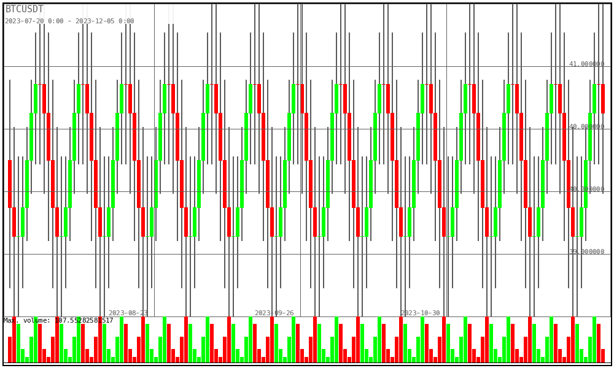

# Dummy History

Trading history dummy generator.
Implements the standards of the [Empirica Platform](https://github.com/empirica-platform), and can be used in projects built on this platform.

Installation
============
```shell
composer recuire gri3li/dummy-history
```

Example
============
Saving an example in a csv file
```php
$iterator = new \EmpiricaPlatform\DummyHistory\OhlcIterator(
    new \EmpiricaPlatform\Common\ValueObject\SymbolPair('BTC', 'USDT'),
    new \DateInterval('P1D'),
    new \DateTimeImmutable('2023-01-05'),
    new \DateTimeImmutable('2023-11-06')
);
$iterator->configure(
    'sin(pi * (n * .2 - .2)) + 40', // open
    'sin(pi * (n * .2 - .2)) + 41', // high
    'sin(pi * (n * .2)) + 39', // low
    'sin(pi * (n * .2)) + 40', // close
    'sin(pi * 2 * (n * .2 - .2 - 1)) * 50 + 60', // volume
);
$fp = fopen('BTCUSDT.csv', 'w');
fputcsv($fp, ['Time', 'Open', 'High', 'Low', 'Close', 'Volume']);
/** @var \EmpiricaPlatform\Common\ValueObject\OhlcDataFrame $frame */
foreach ($iterator as $frame) {
    fputcsv($fp, [$frame->time->format('Y-m-d'), $frame->openPrice, $frame->highPrice, $frame->lowPrice, $frame->closePrice, $frame->volume]);
}
```
To see the result visually, I will install [zkrat/draw-ohlc](https://packagist.org/packages/zkrat/draw-ohlc) package.
```shell
composer require zkrat/draw-ohlc
```
```php
error_reporting(E_ALL ^ E_DEPRECATED ^ E_WARNING);
$list = OhlcList::create(0);
/** @var \EmpiricaPlatform\Common\ValueObject\OhlcDataFrame $frame */
foreach ($iterator as $frame) {
    Ohlc::create(DateTime::from($frame->time), $frame->openPrice, $frame->highPrice, $frame->lowPrice, $frame->closePrice, $frame->volume, $list);
}
$canvas =  DrawCanvas::createCanvas(1000, 600);
$canvas->setFontPath('/Users/miha/PhpstormProjects/skeleton/src/Draw/font/Hack-Regular.ttf');
$drawPrice = DrawOhlcList::create($list, DrawBorder::create($canvas));
DrawBgOhlcList::createBg($drawPrice)->setProductName('BTCUSDT');
DrawVolume::create(75, $drawPrice);
$canvas->drawImage();
```
